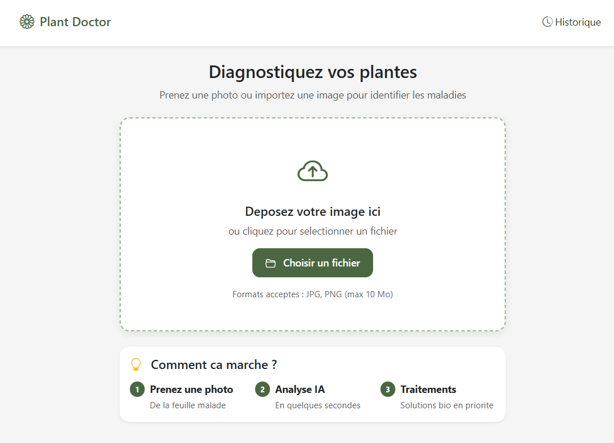
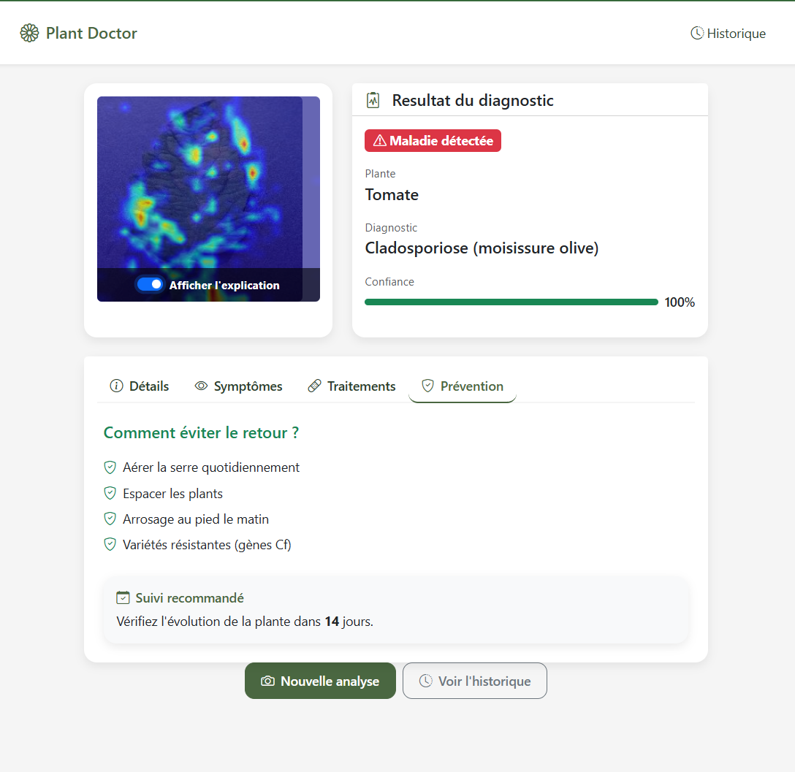
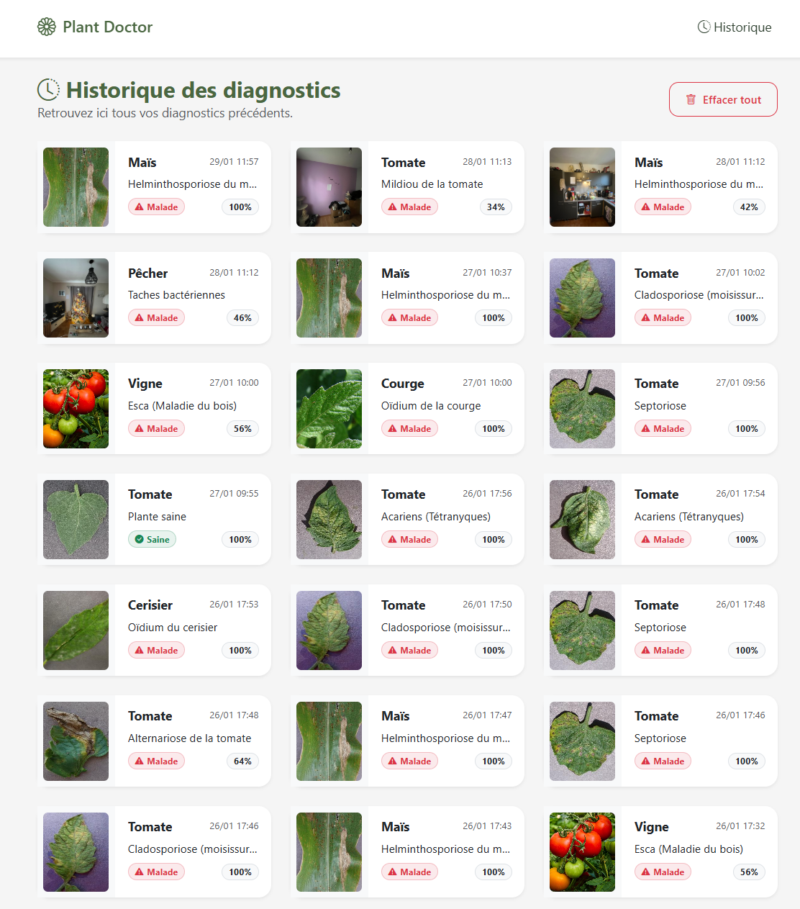

# Plant Doctor

Application web de diagnostic de maladies des plantes utilisant le deep learning. Upload une photo de feuille et obtiens un diagnostic instantane avec des recommandations de traitement.

## Screenshots

| Accueil | Diagnostic | Historique |
|---------|------------|------------|
|  |  |  |

## Fonctionnalites

- **Diagnostic par image** : Upload ou capture de photos de feuilles
- **38 maladies detectees** : Couvre les principales maladies de 14 especes de plantes
- **Visualisation Grad-CAM** : Heatmap montrant les zones analysees par le modele
- **Recommandations** : Conseils de traitement et prevention pour chaque maladie
- **Historique** : Sauvegarde automatique des diagnostics avec possibilite de consultation

## Technologies

### Backend
- **Flask** - Framework web Python
- **ONNX Runtime** - Inference optimisee du modele
- **SQLite** - Base de donnees pour l'historique

### Frontend
- **HTML/CSS/JavaScript** - Interface responsive
- **Drag & Drop** - Upload intuitif des images

### Machine Learning
- **ResNet50** - Architecture CNN pre-entrainee
- **PyTorch** - Framework d'entrainement
- **DirectML** - Acceleration GPU AMD

## Installation

### Prerequisites
- Python 3.9+
- pip

### Setup

1. Cloner le repository
```bash
git clone https://github.com/Michel-Peric/plant_doctor.git
cd plant_doctor
```

2. Creer un environnement virtuel
```bash
python -m venv venv
source venv/bin/activate  # Linux/Mac
venv\Scripts\activate     # Windows
```

3. Installer les dependances
```bash
pip install -r requirements.txt
```

4. Lancer l'application
```bash
python run.py
```

L'application sera accessible sur `http://localhost:5000`

## Tester l'application

Le dossier `samples/` contient des images de test extraites du dataset PlantVillage. Uploadez une de ces images pour verifier que le diagnostic fonctionne.

## Entrainer le modele (optionnel)

Pour re-entrainer le modele, vous devez telecharger le dataset PlantVillage et le placer dans `data/dataset/` :

```
data/dataset/
├── train/
│   ├── Apple___Apple_scab/
│   ├── Apple___Black_rot/
│   └── ...
└── valid/
    ├── Apple___Apple_scab/
    ├── Apple___Black_rot/
    └── ...
```

Puis lancer l'entrainement :

```bash
# Entrainement complet (Phase 1: feature extraction + Phase 2: fine-tuning)
python train_model_pytorch.py

# Reprendre a la Phase 2
python train_model_pytorch.py --resume

# Export vers ONNX
python export_onnx.py
```

## Architecture du Projet

```
plant-doctor/
├── app/
│   ├── routes/          # Endpoints Flask (API et pages)
│   ├── services/        # Logique metier (ML, maladies, Grad-CAM)
│   ├── static/          # CSS, JS, images
│   └── templates/       # Templates HTML Jinja2
├── data/
│   ├── class_labels.json       # Mapping classes -> labels
│   └── diseases_database.json  # Base de donnees des maladies
├── models/
│   └── plant_doctor_resnet50.onnx  # Modele entraine (94 MB)
├── notebooks/           # Notebooks Jupyter d'experimentation
├── samples/             # Images de test
├── config.py            # Configuration Flask
├── run.py               # Point d'entree
├── train_model.py          # Script d'entrainement TensorFlow
├── train_model_pytorch.py  # Script d'entrainement PyTorch
├── export_onnx.py          # Export du modele vers ONNX
└── requirements.txt     # Dependances Python
```

## Pipeline ML

1. **Pre-traitement** : Redimensionnement 224x224, normalisation ImageNet
2. **Inference** : ResNet50 avec couche de classification personnalisee (38 classes)
3. **Post-traitement** : Softmax, seuil de confiance 60%
4. **Explicabilite** : Grad-CAM sur la couche conv finale

## Maladies Detectees

Le modele peut identifier 38 classes couvrant 14 especes :
- Pommier, Myrtille, Cerisier, Mais, Raisin
- Orange, Pecher, Poivron, Pomme de terre, Framboise
- Soja, Courge, Fraise, Tomate

## Performance

- **Accuracy** : ~95% sur le dataset de validation
- **Temps d'inference** : ~200ms sur CPU

## Dataset

Le modele a ete entraine sur le dataset [PlantVillage](https://www.kaggle.com/datasets/emmarex/plantdisease) contenant ~54,000 images de feuilles saines et malades.

## Licence

MIT License

## Auteur

**Peric Michel** - Dev IA chez TechnofuturTIC

Projet realise dans le cadre d'un TFE (Travail de Fin d'Etudes).
